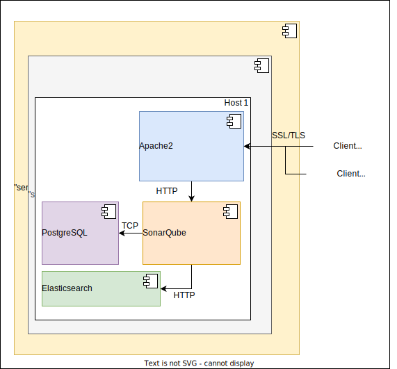

# Ansible playbook: labocbz.deploy_sonarqube


## Description


An Ansible playbook to deploy and configure a SonarQube server on your hosts.

This Ansible playbook orchestrates the installation of SonarQube, PostgreSQL, and Apache2. Notably, SonarQube lacks native SSL support, making the presence of an SSL reverse proxy highly recommended, although its installation is not mandatory in this playbook. The playbook ensures the installation of Java, with version 17 strongly advised, as SonarQube requires a version equal to or greater than 11. Additionally, Apache2 installation is conditional based on a boolean variable.

If remote certificates are available, the playbook can download and install them for Apache2. Security measures, including mod evasive, mod qos, WAF, and optimization configurations, are also managed.

## Deployment diagramm



Here is a possible deployment example with this playbook. The components involved are Apache2, SonarQube, PostgreSQL, and Elasticsearch. We observe that clients access SonarQube through Apache2, which acts as an SSL/TLS proxy. This also applies to analysis results. SonarQube communicates with Elasticsearch and PostgreSQL on the same machine. Elasticsearch is embedded in the SonarQube binaries, while the installation of PostgreSQL is handled in a very basic but sufficient manner by the SonarQube installation role.

## Tests and simulations

### Basics

You have to run multiples tests. *tests with an # are mandatory*

```MARKDOWN
# lint
# syntax
# converge
# idempotence
# verify
side_effect
```

Executing theses test in this order is called a "scenario" and Molecule can handle them.

Molecule use Ansible and pre configured playbook to create containers, prepare them, converge (run the playbook) and verify its execution.
You can manage multiples scenario with multiples tests in order to get a 100% code coverage.

This playbook contains a ./tests folder. In this folder you can use the inventory or the tower folder to create a simualtion of a real inventory and a real AWX / Tower job execution.

### Command reminder

```SHELL
# Check your YAML syntax
yamllint -c ./.yamllint .

# Check your Ansible syntax and code security
ansible-lint --config=./.ansible-lint .

# Execute and test your playbook
molecule lint
molecule create
molecule list
molecule converge
molecule verify
molecule destroy

# Execute all previous task in one single command
molecule test
```

## Installation

To install this playbook, just copy/import this playbook or raw file into your fresh playbook repository or call it with the "include_playbook/import_playbook" module.

## Usage

### Vars

```YAML
# From inventory
---
# all vars from to put/from your inventory
# see tests/inventory/group_var for all groups and vars.
```

```YAML
# From AWX / Tower
---
all vars from to put/from AWX / Tower
```

## Architectural Decisions Records

Here you can put your change to keep a trace of your work and decisions.

### 2024-01-03: First Init

* First init of this playbook with the bootstrap_playbook playbook by Lord Robin Crombez
* Playbook deploy PostgreSQL, Apache2 and SonarQube
* You can install or not Apache2
* Tests added and validated with a local project to analyse
* Pay attention of self signed certs !

## Authors

* Lord Robin Crombez

## Sources

* [Ansible playbook documentation](https://docs.ansible.com/ansible/latest/playbook_guide/playbooks_reuse_playbooks.html)
* [Ansible Molecule documentation](https://molecule.readthedocs.io/)
* [labocbz.prepare_host](https://github.com/CBZ-D-velop/Ansible-Role-Labocbz-Prepare-Host.git)
* [labocbz.add_certificates](https://github.com/CBZ-D-velop/Ansible-Role-Labocbz-Add-Certificates.git)
* [labocbz.install_sonarqube](https://github.com/CBZ-D-velop/Ansible-Role-Labocbz-Install-SonarQube.git)
* [labocbz.install_apache](https://github.com/CBZ-D-velop/Ansible-Role-Labocbz-Install-Apache.git)
* [labocbz.add_apache_confs](https://github.com/CBZ-D-velop/Ansible-Role-Labocbz-Add-Apache-Confs.git)
* [labocbz.add_logrotate_confs](https://github.com/CBZ-D-velop/Ansible-Role-Labocbz-Add-Logrotate-Confs.git)
* [labocbz.install_java](https://github.com/CBZ-D-velop/Ansible-Role-Labocbz-Install-Java.git)
